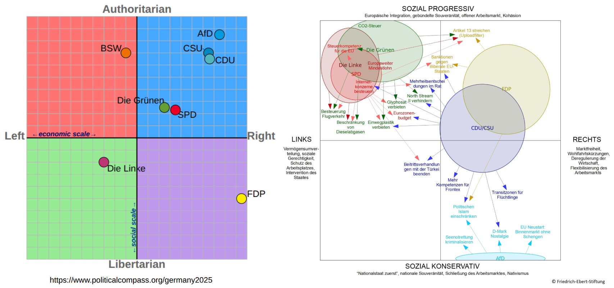
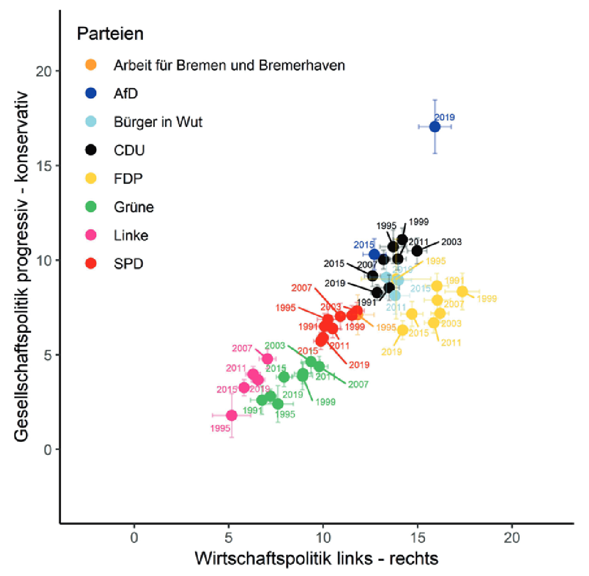
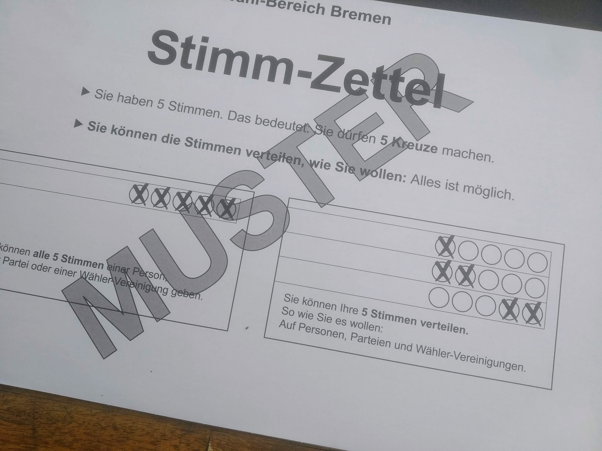
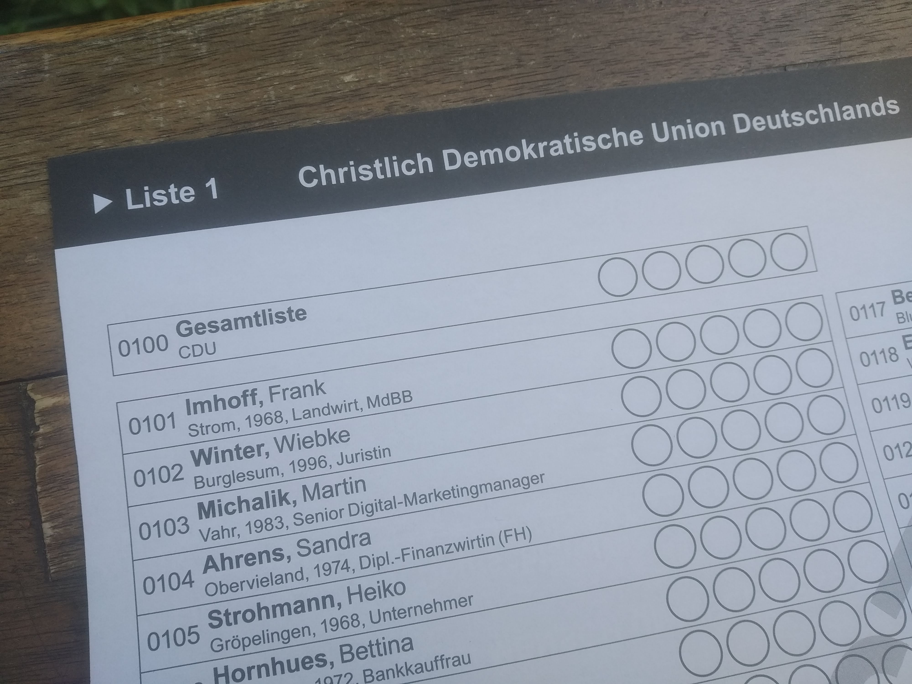
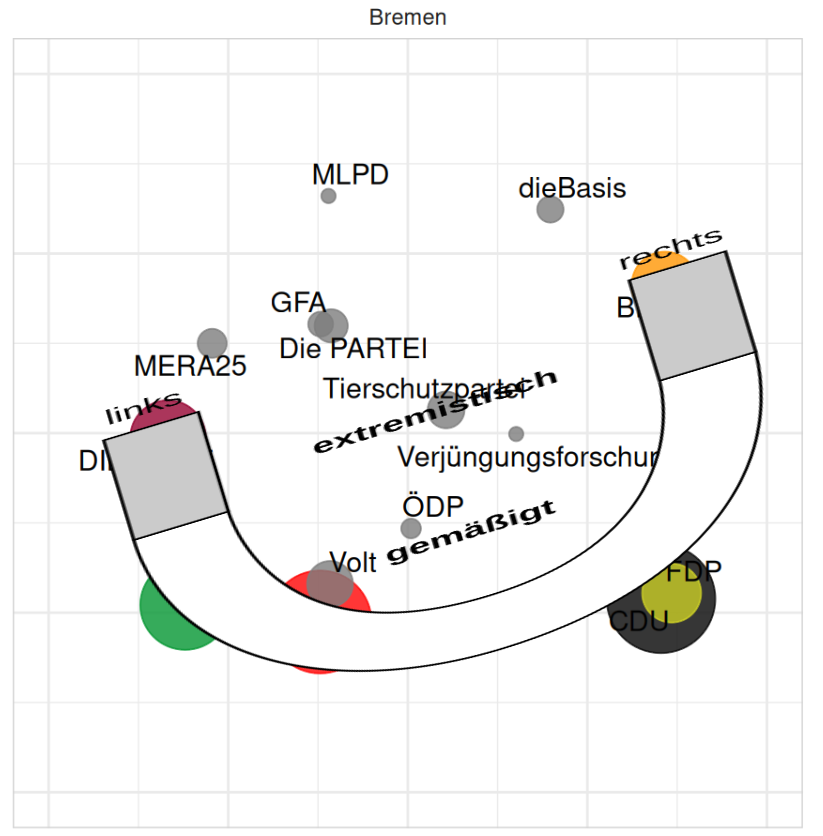

## Politische Landschaften




## Politische Landschaften in Bremen

::: {.columns}
::: {.column}
Bestimmung aus den Texten der Wahlprogramme nach der `wordscores` Methods.

- Weitgehend eindimensionale Landschaft
- Leicht Abweichung bei Linke und FDP
:::
::: {.column width='50%'}

:::
:::


::: aside
Bräuninger, T., Debus, M., Müller, J., & Stecker, C. (2020). [Parteienwettbewerb in den deutschen Bundesländern.](https://doi.org/10.1007/978-3-658-29222-5) Springer Fachmedien.
:::

## Wahlen zur Bremischen Bürgerschaft

<!-- What Your Ballot Reveals About Bremen’s Political Landscape
Prof. Jan Lorenz – Social Data Science
Every Bremen voter gets five votes to split across parties and candidates — and those choices leave a trail. By tracking which parties voters tend to pick together, Jan Lorenz maps the hidden shape of Bremen's political landscape: a straight line, a horseshoe, or something else entirely. With another election just a year away, the timing couldn't be better.
Time: 13:40 – 14:00 | Location: TBD | Language: German | Duration: 20 minutes -->

```{r}
#| include: false
library(tidyverse)
library(glue)
library(arrow)
library(plotly)
library(gt)
library(ggiraph)
library(patchwork)

library(ggrepel)
library(gtExtras)
library(ggparliament)
library(ggbump)

# Daten
Parteifarben <- tibble(
  Partei = c(
    "SPD",
    "CDU",
    "GRÜNE",
    "FDP",
    "DIE LINKE",
    "BIW",
    "AfD",
    "Volt",
    "Tierschutzpartei",
    "dieBasis",
    "Die PARTEI",
    "MERA25",
    "GFA",
    "ÖDP"
  ),
  Farbe = c(
    "#ff0000",
    "#000000",
    "#009933",
    "#ced121",
    "#990033",
    "#ff9900",
    "#0099ff",
    "#666666",
    "#777777",
    "#888888",
    "#999999",
    "#aaaaaa",
    "#bbbbbb",
    "#cccccc"
  ),
  Textfarbe = c(
    "white",
    "white",
    "white",
    "black",
    "white",
    "black",
    "white",
    "white",
    "white",
    "white",
    "white",
    "black",
    "black",
    "black"
  )
)
Stimmzettel_Stats <- read_parquet("data/Stimmzettel_Stats.parquet")
Stimmzettel_nurParteien <- read_parquet("data/Stimmzettel_nurParteien.parquet")
Kandidaten_Stats <- read_parquet("data/Kandidaten_Stats.parquet")
Listen_Stats_MDS <- read_parquet("data/Listen_Stats_MDS.parquet")
Mandate_Parteien <- read_parquet("data/Mandate_Parteien.parquet")
Mandate_Kandidaten <- read_parquet("data/Mandate_Kandidaten.parquet") |>
  mutate(
    fullname = glue(
      "{if_else(is.na(Titel),'',glue('{Titel} '))}{Vorname} {Name}"
    ),
    tooltip_info = glue(
      "{Kennnummer} {fullname} ({Geschlecht})\n{Beruf}, {`Stadt- oder Ortsteil`}\n{Stimmen} Stimmen, {Wähler} Wähler"
    )
  ) |>
  left_join(Parteifarben, by = join_by(Kurzform == Partei))
Mandate_ListePersonen <- read_parquet("data/Mandate_ListePersonen.parquet")
Relevanzschwellen <- read_parquet("data/Relevanzschwellen.parquet")
Wahlvorschläge <- read_parquet("data/Wahlvorschläge.parquet")
CoVotersBremen2023 <- read_parquet("CoVotersBremen2023.parquet") |>
  mutate(`X-Wähler wählen Y` = 1 - dissim_voters_x) |>
  select(
    X = partyname,
    Y = partyname2,
    `Gemeinsame Wähler` = co_voters,
    `X-Wähler wählen Y`
  ) |>
  filter(X != Y)
```

- Zwei Wahlgebiete
    - **Bremen** (Stadt) [**72**]{style='color:red;'} Abgeordnete
    - **Bremerhaven** [**15**]{style='color:red;'} Abgeordnete
- Technisch unabhängige Wahlen: Eigene Listen, eigene 5% Sperrklausel    

```{r}
#| fig-align: center
#| fig-height: 2
HB <- tibble(party_short = c("Bremen", "Bremerhaven"), seats = c(72, 15))
parliament_data(
  HB,
  type = "semicircle",
  parl_rows = 5,
  party_seats = HB$seats
) |>
  ggplot(aes(x = x, y = y, shape = party_short)) +
  geom_parliament_seats(size = 5) +
  theme_ggparliament() +
  coord_fixed() +
  scale_shape_manual(values = c(19, 21)) +
  theme_void(base_size = 24) +
  theme(legend.title = element_blank())
```


## Wählen: 5 Stimmen irgendwie aufteilen 



## Wählen: Listenstimmen und Personenstimmen



## Stimmzettel Erfassung, Auszählung

:::: {.columns}

::: {.column width='42%'}
```{r}
Stimmzettel_Beispiel_tab <- Stimmzettel_Stats |>
  filter(Wahlbezirk == "Bremen", Jahr == 2023, n > 20) |>
  arrange(desc(n)) |> #View()
  slice(c(1, 2, 3, 4, 34, 47, 97, 108, 181, 360, 382, 413, 426, 432, 529)) |>
  select(starts_with("Stimme"), n) |>
  gt() |>
  tab_header(title = "Beispiele Stimmzettel 2023") |>
  cols_align(align = "center") |>
  tab_options(data_row.padding = px(3))
Stimmzettel_Beispiel_tab |>
  tab_options(data_row.padding = px(3))
```
:::

::: {.column width='58%'}

```{r}
Wahlvorschläge |>
  filter(
    Wahlbezirk == "Bremen",
    Jahr == 2023,
    Kennnummer %in%
      c(100, 101, 200, 201, 203, 237, 300, 314, 400, 401, 402, 500, 600, 1600)
  ) |>
  select(
    ID = Kennnummer,
    Partei,
    Name,
    Stimmen,
    Wähler,
    `Stimmen pro Wähler` = Stimmen_pro_Wähler
  ) |>
  arrange(ID) |>
  gt() |>
  tab_header(title = "Beispiele Wahlergebnis Bremen 2023") |>
  fmt_number(starts_with("Stimmen "), decimals = 1) |>
  tab_options(data_row.padding = px(3))
```
:::
::::


## Viele Stimmzettel sind einzigartig

```{r}
#| fig-width: 6

Einzigartige <- Stimmzettel_Stats |>
  filter(!is.na(Stimme1), Wahlbezirk == "Bremen") |>
  summarize(
    Einzigartige = sum(if_else(n == 1, n, 0)),
    `2-10mal` = sum(if_else(n >= 2 & n <= 10, n, 0)),
    `11-100mal` = sum(if_else(n >= 11 & n <= 100, n, 0)),
    `101-1000mal` = sum(if_else(n >= 101 & n <= 1000, n, 0)),
    `>1000mal` = sum(if_else(n >= 1000, n, 0)),
    .by = c(Jahr)
  )
Einzigartige |>
  pivot_longer(c(
    Einzigartige,
    `2-10mal`,
    `11-100mal`,
    `101-1000mal`,
    `>1000mal`
  )) |>
  ggplot(aes(x = Jahr, y = value, fill = name)) +
  geom_col() +
  scale_x_continuous(breaks = seq(2011, 2023, by = 4)) +
  scale_y_continuous(
    labels = scales::label_number(big.mark = ".", decimal.mark = ","),
    breaks = seq(25000, 250000, by = 25000)
  ) +
  scale_fill_manual(
    values = rev(c("darkred", "gray75", "gray65", "gray55", "gray45")),
    labels = rev(c(
      "Einzigartige",
      "2-10mal",
      "11-100mal",
      "101-1000mal",
      ">1000mal"
    ))
  ) +
  labs(x = "", y = "", fill = "", title = "Wahlbezirk Bremen") +
  theme_minimal()
```

. . .
 
Die Stimmzettel-Daten werden vom statistischen Landesamt nur zur Verfügung gestellt, wenn das Wahlgeheimnis durch die Forscher nicht gefährdet wird. (Vertragsstrafen)

## Vereinfachung: Personenstimmen als Parteistimmen

1XX -> 100, 2XX -> 200, ... Die 50 häufigsten Parteimuster.

```{r}
g1 <- Stimmzettel_nurParteien |>
  filter(Jahr == 2023, Wahlbezirk == "Bremen", !is.na(Stimme1)) |>
  arrange(desc(n)) |>
  mutate(id = row_number()) |>
  slice(1:50) |>
  pivot_longer(starts_with("Stimme")) |>
  left_join(
    Listen_Stats_MDS |>
      filter(Jahr == 2023, Wahlbezirk == "Bremen") |>
      select(Kennnummer, Kurzform),
    by = join_by(value == Kennnummer)
  ) |>
  left_join(
    Parteifarben,
    by = join_by(Kurzform == Partei)
  ) |>
  mutate(n = fct_inorder(factor(n))) |>
  ggplot(aes(x = "", fill = Farbe, label = Kurzform)) +
  geom_bar(width = 1) +
  coord_polar(theta = "y") +
  facet_wrap(~n, nrow = 5) +
  scale_fill_identity() +
  theme_void()
g2 <- ggplot(
  Parteifarben,
  aes(x = 1, y = 1, fill = factor(Partei, levels = Partei))
) +
  geom_point(alpha = 0) +
  scale_fill_manual(
    values = setNames(Parteifarben$Farbe, Parteifarben$Partei),
    name = "Partei"
  ) +
  guides(
    fill = guide_legend(
      override.aes = list(alpha = 1, shape = 22, size = 8),
      ncol = 2,
      title = ""
    )
  ) +
  theme_void()
g1 + g2 + plot_layout(widths = c(6, 1))
```


# Die Politische Landschaft 

## Ähnlichkeit von Parteien durch gemeinsame Wähler
:::: {.columns}

::: {.column width='50%'}

```{r}
Tab <- CoVotersBremen2023 |>
  filter(X == "CDU") |>
  left_join(
    CoVotersBremen2023 |>
      filter(Y == "CDU") |>
      select(-X, X = Y, `Y-Wähler wählen X` = `X-Wähler wählen Y`),
    by = join_by(X, `Gemeinsame Wähler`)
  ) |>
  left_join(Parteifarben, by = join_by(X == Partei)) |>
  rename(FarbeX = Farbe, TextfarbeX = Textfarbe) |>
  left_join(Parteifarben, by = join_by(Y == Partei)) |>
  rename(FarbeY = Farbe, TextfarbeY = Textfarbe)
Tab |>
  gt() |>
  cols_hide(c("FarbeX", "FarbeY", "TextfarbeX", "TextfarbeY")) |>
  fmt_percent(c(`Y-Wähler wählen X`, `X-Wähler wählen Y`)) |>
  data_color("X", method = "factor", palette = Tab$FarbeX) |>
  data_color("Y", method = "factor", palette = Tab$FarbeY[c(5, 3, 4, 2, 1)])
```
  
```{r}
Tab <- CoVotersBremen2023 |>
  filter(X == "SPD", Y != "CDU") |>
  left_join(
    CoVotersBremen2023 |>
      filter(Y == "SPD") |>
      select(-X, X = Y, `Y-Wähler wählen X` = `X-Wähler wählen Y`),
    by = join_by(X, `Gemeinsame Wähler`)
  ) |>
  left_join(Parteifarben, by = join_by(X == Partei)) |>
  rename(FarbeX = Farbe, TextfarbeX = Textfarbe) |>
  left_join(Parteifarben, by = join_by(Y == Partei)) |>
  rename(FarbeY = Farbe, TextfarbeY = Textfarbe)
Tab |>
  gt() |>
  cols_hide(c("FarbeX", "FarbeY", "TextfarbeX", "TextfarbeY")) |>
  fmt_percent(c(`Y-Wähler wählen X`, `X-Wähler wählen Y`)) |>
  data_color("X", method = "factor", palette = Tab$FarbeX) |>
  data_color("Y", method = "factor", palette = Tab$FarbeY[c(4, 2, 3, 1)])
```
:::

::: {.column width='50%'}
```{r}
Tab <- CoVotersBremen2023 |>
  filter(X == "GRÜNE", Y != "CDU", Y != "SPD") |>
  left_join(
    CoVotersBremen2023 |>
      filter(Y == "GRÜNE") |>
      select(-X, X = Y, `Y-Wähler wählen X` = `X-Wähler wählen Y`),
    by = join_by(X, `Gemeinsame Wähler`)
  ) |>
  left_join(Parteifarben, by = join_by(X == Partei)) |>
  rename(FarbeX = Farbe, TextfarbeX = Textfarbe) |>
  left_join(Parteifarben, by = join_by(Y == Partei)) |>
  rename(FarbeY = Farbe, TextfarbeY = Textfarbe)
Tab |>
  gt() |>
  cols_hide(c("FarbeX", "FarbeY", "TextfarbeX", "TextfarbeY")) |>
  fmt_percent(c(`Y-Wähler wählen X`, `X-Wähler wählen Y`)) |>
  data_color("X", method = "factor", palette = Tab$FarbeX) |>
  data_color("Y", method = "factor", palette = Tab$FarbeY[c(3, 1, 2)])
```

```{r}
Tab <- CoVotersBremen2023 |>
  filter(X == "DIE LINKE", Y != "GRÜNE", Y != "CDU", Y != "SPD") |>
  left_join(
    CoVotersBremen2023 |>
      filter(Y == "DIE LINKE") |>
      select(-X, X = Y, `Y-Wähler wählen X` = `X-Wähler wählen Y`),
    by = join_by(X, `Gemeinsame Wähler`)
  ) |>
  left_join(Parteifarben, by = join_by(X == Partei)) |>
  rename(FarbeX = Farbe, TextfarbeX = Textfarbe) |>
  left_join(Parteifarben, by = join_by(Y == Partei)) |>
  rename(FarbeY = Farbe, TextfarbeY = Textfarbe)
Tab |>
  gt() |>
  cols_hide(c("FarbeX", "FarbeY", "TextfarbeX", "TextfarbeY")) |>
  fmt_percent(c(`Y-Wähler wählen X`, `X-Wähler wählen Y`)) |>
  data_color("X", method = "factor", palette = Tab$FarbeX) |>
  data_color("Y", method = "factor", palette = Tab$FarbeY[c(2, 1)])
```
:::
::::


## Politischer Raum 2023

```{r}
Listen_Stats_MDS |>
  filter(Jahr == 2023) |>
  left_join(Parteifarben, by = join_by(Kurzform == Partei)) |>
  mutate(Farbe = if_else(is.na(Farbe), "gray50", Farbe)) |>
  ggplot() +
  aes(x = x, y = y, color = Farbe, label = Kurzform, size = Wähler) +
  geom_point(alpha = 0.8) +
  geom_text_repel(size = 4, color = "black") +
  facet_grid(Jahr ~ Wahlbezirk) +
  coord_equal() +
  xlim(c(-0.5, 0.5)) +
  ylim(c(-0.5, 0.5)) +
  scale_color_identity() +
  scale_size_area(max_size = 20) +
  labs(x = "", y = "") +
  theme_minimal() +
  theme(
    panel.border = element_rect(colour = "lightgray", fill = NA),
    axis.text.x = element_blank(),
    axis.text.y = element_blank()
  ) +
  guides(size = "none")
```

::: aside
Die Positionen wurden mit multidimensionaler Skalierung berechnet. Zugrunde liegen als Distanzmatrix die paarweisen symmetrischen Wahrscheinlichkeiten, dass ein Wähler aus einer der beiden Parteien nicht die andere Partei wählt. Die Methode erzeugt Positionen die diese Distanzen bestmöglich im 2-dimensionalen Raum abbilden. 
:::

## Politischer Raum 2019

```{r}
Listen_Stats_MDS |>
  filter(Jahr == 2019) |>
  left_join(Parteifarben, by = join_by(Kurzform == Partei)) |>
  mutate(Farbe = if_else(is.na(Farbe), "gray50", Farbe)) |>
  ggplot() +
  aes(x = x, y = y, color = Farbe, label = Kurzform, size = Wähler) +
  geom_point(alpha = 0.8) +
  geom_text_repel(size = 4, color = "black") +
  facet_grid(Jahr ~ Wahlbezirk) +
  coord_equal() +
  xlim(c(-0.5, 0.5)) +
  ylim(c(-0.5, 0.5)) +
  scale_color_identity() +
  scale_size_area(max_size = 20) +
  labs(x = "", y = "") +
  theme_minimal() +
  theme(
    panel.border = element_rect(colour = "lightgray", fill = NA),
    axis.text.x = element_blank(),
    axis.text.y = element_blank()
  ) +
  guides(size = "none")
```

::: aside
Die Positionen wurden multidimensionaler Skalierung berechnet. Zugrunde liegen als Distanzmatrix die paarweisen symmetrischen Wahrscheinlichkeiten, dass ein Wähler aus einer der beiden Parteien nicht die andere Partei wählt. Die Methode erzeugt Positionen die diese Distanzen bestmöglich im 2-dimensionalen Raum abbilden. 
:::

## Politischer Raum 2015

```{r}
Listen_Stats_MDS |>
  filter(Jahr == 2015) |>
  left_join(Parteifarben, by = join_by(Kurzform == Partei)) |>
  mutate(Farbe = if_else(is.na(Farbe), "gray50", Farbe)) |>
  ggplot() +
  aes(x = x, y = y, color = Farbe, label = Kurzform, size = Wähler) +
  geom_point(alpha = 0.8) +
  geom_text_repel(size = 4, color = "black") +
  facet_grid(Jahr ~ Wahlbezirk) +
  coord_equal() +
  xlim(c(-0.5, 0.5)) +
  ylim(c(-0.5, 0.5)) +
  scale_color_identity() +
  scale_size_area(max_size = 20) +
  labs(x = "", y = "") +
  theme_minimal() +
  theme(
    panel.border = element_rect(colour = "lightgray", fill = NA),
    axis.text.x = element_blank(),
    axis.text.y = element_blank()
  ) +
  guides(size = "none")
```

::: aside
Die Positionen wurden multidimensionaler Skalierung berechnet. Zugrunde liegen als Distanzmatrix die paarweisen symmetrischen Wahrscheinlichkeiten, dass ein Wähler aus einer der beiden Parteien nicht die andere Partei wählt. Die Methode erzeugt Positionen die diese Distanzen bestmöglich im 2-dimensionalen Raum abbilden. 
:::

## Politischer Raum 2011

```{r}
Listen_Stats_MDS |>
  filter(Jahr == 2011) |>
  left_join(Parteifarben, by = join_by(Kurzform == Partei)) |>
  mutate(Farbe = if_else(is.na(Farbe), "gray50", Farbe)) |>
  ggplot() +
  aes(x = x, y = y, color = Farbe, label = Kurzform, size = Wähler) +
  geom_point(alpha = 0.8) +
  geom_text_repel(size = 4, color = "black") +
  facet_grid(Jahr ~ Wahlbezirk) +
  coord_equal() +
  xlim(c(-0.5, 0.5)) +
  ylim(c(-0.5, 0.5)) +
  scale_color_identity() +
  scale_size_area(max_size = 20) +
  labs(x = "", y = "") +
  theme_minimal() +
  theme(
    panel.border = element_rect(colour = "lightgray", fill = NA),
    axis.text.x = element_blank(),
    axis.text.y = element_blank()
  ) +
  guides(size = "none")
```

::: aside
Die Positionen wurden multidimensionaler Skalierung berechnet. Zugrunde liegen als Distanzmatrix die paarweisen symmetrischen Wahrscheinlichkeiten, dass ein Wähler aus einer der beiden Parteien nicht die andere Partei wählt. Die Methode erzeugt Positionen die diese Distanzen bestmöglich im 2-dimensionalen Raum abbilden. 
:::


## Politischer Raum

```{r}
Listen_Stats_MDS |>
  left_join(Parteifarben, by = join_by(Kurzform == Partei)) |>
  mutate(Farbe = if_else(is.na(Farbe), "gray50", Farbe)) |>
  ggplot() +
  aes(x = x, y = y, color = Farbe, label = Kurzform, size = Wähler) +
  geom_point(alpha = 0.8) +
  #  geom_text_repel(size = 2) +
  facet_grid(Wahlbezirk ~ Jahr) +
  coord_equal() +
  xlim(c(-0.5, 0.5)) +
  ylim(c(-0.5, 0.5)) +
  scale_color_identity() +
  scale_size_area() +
  labs(x = "", y = "") +
  theme_minimal() +
  theme(
    panel.border = element_rect(colour = "lightgray", fill = NA),
    axis.text.x = element_blank(),
    axis.text.y = element_blank()
  ) +
  guides(size = "none")
```

## Co-Wähler vs. Wahlprogramm-Texte

:::: {.columns}

::: {.column width='50%'}
```{r}
#| fig-width: 5

Listen_Stats_MDS |>
  filter(Jahr == 2023, Wahlbezirk == "Bremen") |>
  left_join(Parteifarben, by = join_by(Kurzform == Partei)) |>
  mutate(Farbe = if_else(is.na(Farbe), "gray50", Farbe)) |>
  ggplot() +
  aes(x = x, y = y, color = Farbe, label = Kurzform, size = Wähler) +
  geom_point(alpha = 0.8) +
  geom_text_repel(size = 4, color = "black") +
  facet_grid(Jahr ~ Wahlbezirk) +
  coord_equal() +
  xlim(c(-0.5, 0.5)) +
  ylim(c(-0.5, 0.5)) +
  scale_color_identity() +
  scale_size_area(max_size = 20) +
  labs(x = "", y = "") +
  theme_minimal() +
  theme(
    panel.border = element_rect(colour = "lightgray", fill = NA),
    axis.text.x = element_blank(),
    axis.text.y = element_blank()
  ) +
  guides(size = "none")
```
:::

::: {.column width='50%'}

:::

::::


## Hufeisen-Schema?

::: {.columns}
::: {.column}

:::
::: {.column .fragment}

:::
:::


# Appendix

## Häufigste Stimmzettelmuster 2019


```{r}
g1 <- Stimmzettel_nurParteien |>
  filter(Jahr == 2019, Wahlbezirk == "Bremen", !is.na(Stimme1)) |>
  arrange(desc(n)) |>
  mutate(id = row_number()) |>
  slice(1:50) |>
  pivot_longer(starts_with("Stimme")) |>
  left_join(
    Listen_Stats_MDS |>
      filter(Jahr == 2019, Wahlbezirk == "Bremen") |>
      select(Kennnummer, Kurzform),
    by = join_by(value == Kennnummer)
  ) |>
  left_join(
    Parteifarben,
    by = join_by(Kurzform == Partei)
  ) |>
  mutate(facetname = fct_inorder(paste0(id, ": ", n))) |>
  ggplot(aes(x = "", fill = Farbe, label = Kurzform)) +
  geom_bar(width = 1) +
  coord_polar(theta = "y") +
  facet_wrap(~facetname, nrow = 5) +
  scale_fill_identity() +
  theme_void()
g2 <- ggplot(
  Parteifarben,
  aes(x = 1, y = 1, fill = factor(Partei, levels = Partei))
) +
  geom_point(alpha = 0) +
  scale_fill_manual(
    values = setNames(Parteifarben$Farbe, Parteifarben$Partei),
    name = "Partei"
  ) +
  guides(
    fill = guide_legend(
      override.aes = list(alpha = 1, shape = 22, size = 8),
      ncol = 2,
      title = ""
    )
  ) +
  theme_void()
g1 + g2 + plot_layout(widths = c(6, 1))
```


## Wahl-O-Mat 2023 MDS

```{r}
#| label: wahlomat
library(readxl)
wm <- read_xlsx(
  "data/Wahl-O-Mat Bremen 2023_Datensatz_v1.01.xlsx",
  sheet = "Datensatz HB 2023"
)
library(ggrepel)

wm_positions <- wm |>
  select(
    Partei = `Partei: Kurzbezeichnung`,
    These = `These: Nr.`,
    Position = `Position: Position`
  ) |>
  filter(
    !is.na(These),
    Partei != "dieBasis",
    Partei != "Partei für schulmedizinische Verjüngungsforschung"
  ) |>
  mutate(
    Position_num = case_when(
      Position == "stimme zu" ~ 1,
      Position == "neutral" ~ 0,
      Position == "stimme nicht zu" ~ -1
    )
  )

pos_matrix <- wm_positions |>
  select(Partei, These, Position_num) |>
  pivot_wider(names_from = These, values_from = Position_num) |>
  column_to_rownames("Partei") |>
  as.matrix()

d <- dist(pos_matrix, method = "manhattan")
mds <- cmdscale(d, k = 2) |>
  as_tibble(rownames = "Partei") |>
  rename(Dim1 = V1, Dim2 = V2) |>
  mutate(Dim1 = -Dim1)

ggplot(mds, aes(Dim1, Dim2, label = Partei, color = Partei)) +
  geom_point(size = 3) +
  geom_text_repel(size = 3, max.overlaps = 20, show.legend = FALSE) +
  scale_color_manual(
    values = setNames(Parteifarben$Farbe, Parteifarben$Partei),
    guide = "none"
  ) +
  labs(
    title = "MDS der Wahl-O-Mat-Positionen (Bremen 2023)",
    x = "",
    y = ""
  ) +
  coord_fixed() +
  theme_minimal()
```
