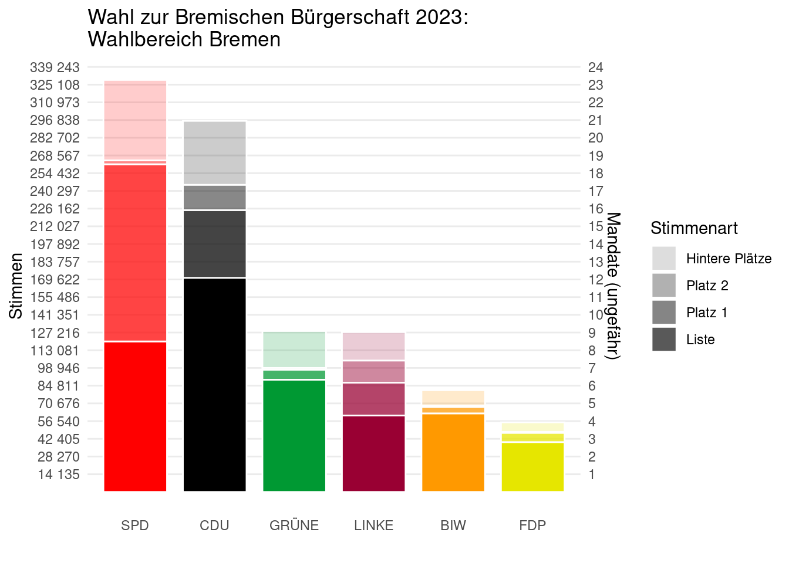
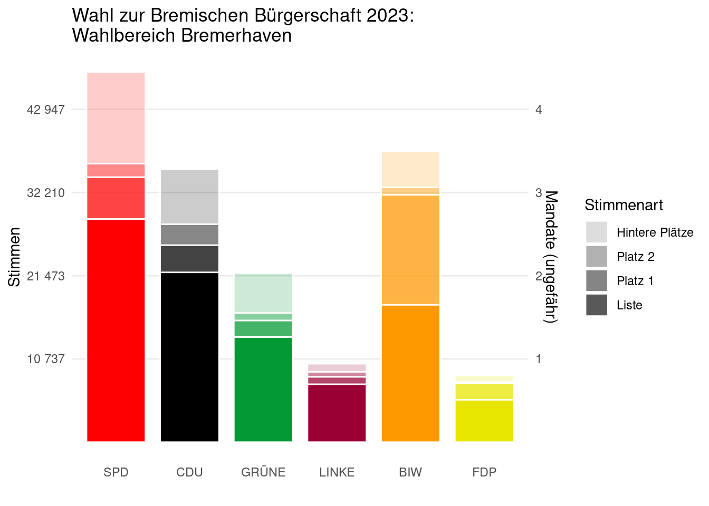
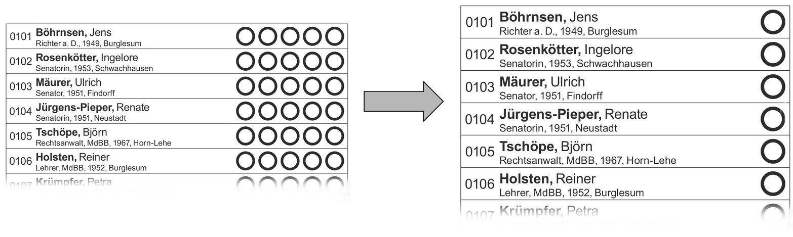

```{r}
#| include: false
library(tidyverse)
library(glue)
library(arrow)
library(plotly)
library(gt)
library(ggiraph)
library(patchwork)

library(ggrepel)
library(gtExtras)
library(ggparliament)
library(ggbump)
#library(ComplexUpset)

# Daten
Parteifarben <- tibble(Partei = c("SPD","CDU","GRÜNE","FDP","DIE LINKE","BIW","AfD"), 
                       Farbe = c("#ff0000", "#000000", "#009933","#ced121","#990033", "#ff9900", "#0099ff"),
                       Textfarbe = c("white","white","white","black","white","black","white"))
Stimmzettel_Stats <- read_parquet("data/Stimmzettel_Stats.parquet")
Kandidaten_Stats <- read_parquet("data/Kandidaten_Stats.parquet")
Listen_Stats_MDS <- read_parquet("data/Listen_Stats_MDS.parquet")
Mandate_Parteien <- read_parquet("data/Mandate_Parteien.parquet")
Mandate_Kandidaten <- read_parquet("data/Mandate_Kandidaten.parquet") |> 
  mutate(
    fullname = glue("{if_else(is.na(Titel),'',glue('{Titel} '))}{Vorname} {Name}"),
    tooltip_info = glue("{Kennnummer} {fullname} ({Geschlecht})\n{Beruf}, {`Stadt- oder Ortsteil`}\n{Stimmen} Stimmen, {Wähler} Wähler")) |> 
  left_join(Parteifarben, by = join_by(Kurzform == Partei))
Mandate_ListePersonen <- read_parquet("data/Mandate_ListePersonen.parquet")
Relevanzschwellen <- read_parquet("data/Relevanzschwellen.parquet")
Wahlvorschläge <- read_parquet("data/Wahlvorschläge.parquet")
CoVotersBremen2023 <- read_parquet("CoVotersBremen2023.parquet") |> 
  mutate(`X-Wähler wählen Y` = 1 - dissim_voters_x) |> 
  select(X = partyname, Y = partyname2, `Gemeinsame Wähler` = co_voters, `X-Wähler wählen Y`) |> 
  filter(X != Y)
zuteilen_nach_hoechstzahlen <- function(N, Stimmen) {
  Stimmen <- Stimmen/sum(Stimmen)
  divisoren <- (1:N)-0.5 # divisorfolge="saintlague"
  hoechstzahlen <- purrr::as_vector(purrr::map(Stimmen, function(x) x / divisoren))
  partei_labels <- rep(1:length(Stimmen), each = N)
  mandate <- partei_labels[order(hoechstzahlen, decreasing = TRUE)[1:N]]
  tabulate(mandate, nbins = length(Stimmen))
}
```

## Die Bremische Bürgerschaft

- Zwei Wahlgebiete
    - **Bremen** (Stadt) [**72**]{style='color:red;'} Abgeordnete
    - **Bremerhaven** [**15**]{style='color:red;'} Abgeordnete
- Technisch zwei unabhängige Wahlen: Eigene Listen, eigene 5% Sperrklausel    

```{r}
#| fig-align: center
#| fig-height: 2
HB <- tibble(party_short = c("Bremen","Bremerhaven"), seats = c(72,15)) 
parliament_data(HB, type = "semicircle",
                parl_rows = 5,
                party_seats = HB$seats) |> 
ggplot(aes(x = x, y = y, shape = party_short)) +
  geom_parliament_seats(size = 5) + 
  theme_ggparliament() + 
  coord_fixed() +
  scale_shape_manual(values = c(19,21)) +
  theme_void(base_size = 24) +
  theme(legend.title=element_blank())
```


# Das 5-Stimmen Wahlsystem

## Wählen: 5 Stimmen irgendwie aufteilen 


## Wählen: Listenstimmen und Personenstimmen


## Stimmzettel Erfassung

:::: {.columns}

::: {.column width='55%'}
- Auf dem Stimm-Zettel hat jede Partei und jede Person eine ID-Nummer
    - Die erste(n) Stelle(n) bezeichnen die Liste
    - Die letzten beiden Stellen bezeichnen den Listenplatz einer Person, Listenplatz 0 steht für eine Listenstimme
- Stimm-Zettel werden digital erfasst (je 5 ID-Nummern)

Beispiele: 

200 $\to$ [02]{style="border: 1px solid; padding: 0px 2px 0px 2px"} [00]{style="border: 1px solid; padding: 0px 2px 0px 2px"} $\to$ Liste 2, Listenstimme

417 $\to$ [04]{style="border: 1px solid; padding: 0px 2px 0px 2px"} [17]{style="border: 1px solid; padding: 0px 2px 0px 2px"} $\to$ Liste 4, Person Listenplatz 17 
:::

::: {.column width='45%'}
```{r}
Stimmzettel_Beispiel_tab <- Stimmzettel_Stats |> 
  filter(Wahlbezirk == "Bremen", Jahr == 2023, n>20) |> arrange(desc(n)) |> #View()
  slice(c(1,2,3,4,34,47,97,108,181,360,382,413,426,432,529)) |> 
  select(starts_with("Stimme"), n) |> 
  gt() |> 
  tab_header(title = "Beispiele Stimmzettel 2023") |> 
  cols_align(align = "center") |> 
  tab_options(data_row.padding = px(3))
Stimmzettel_Beispiel_tab
```
:::
::::


## Auszählen des Wahlergebnis (2023)

:::: {.columns}

::: {.column width='42%'}
```{r}
Stimmzettel_Beispiel_tab  |> 
  tab_options(data_row.padding = px(3))
```
:::

::: {.column width='58%'}

```{r}
Wahlvorschläge |> 
  filter(Wahlbezirk == "Bremen", 
         Jahr == 2023, 
         Kennnummer %in% c(100,101,200,201,203,237,300,314,400,401,402,500,600,1600)) |> 
  select(ID=Kennnummer, Partei, Name, Stimmen, Wähler, `Stimmen pro Wähler` = Stimmen_pro_Wähler) |> 
  arrange(ID) |> 
  gt() |> 
  tab_header(title = "Beispiele Wahlergebnis Bremen 2023") |>  
  fmt_number(starts_with("Stimmen "), decimals = 1) |> 
  tab_options(data_row.padding = px(3))
```
:::
::::


## Einzigartige Stimmzettel

- Viele Stimmzettel existieren nur einmal!

```{r}
Stimmzettel_Stats |> 
  filter(!is.na(Stimme1)) |> 
  summarize(Gültige = sum(n), 
            Einzigartige = sum(if_else(n == 1, 1, 0)),
            `Anteil Einzigartige` = Einzigartige/Gültige,
            .by = c(Jahr, Wahlbezirk)) |>
  pivot_wider(names_from = c(Wahlbezirk), values_from = c(Gültige, Einzigartige, `Anteil Einzigartige`)) |> 
  gt() |> 
  tab_spanner(label = "Bremen", ends_with("Bremen")) |> 
  tab_spanner(label = "Bremerhaven", ends_with("Bremerhaven")) |> 
  cols_label(
    starts_with("Gü") ~ "Gültige",
    starts_with("Ein") ~ "Einzigartige",
    starts_with("An") ~ "Anteil Einzigartige"
  ) |> 
  fmt_percent(starts_with("Anteil ")) |> 
  fmt_integer(c(starts_with("Gü"), starts_with("Ein")), sep_mark = ".")
```

. . .
 
- Die Stimmzettel-Daten werden vom statistischen Landesamt nur zur Verfügung gestellt, wenn das Wahlgeheimnis durch die Forscher nicht gefährdet wird. (Vertragsstrafen)
- In den einzigartigen Stimmzetteln könnte eine potentielle Gefährdung des Wahlgeheimnis liegen, wenn man von einzelnen Wähler z.B. 4 Stimmen kennt die immernoch einzigartig sind, dann ließe sich die 5. Stimme wissen. 2


# Die Politische Landschaft 

## Ähnlichkeit von Parteien durch gemeinsame Wähler
:::: {.columns}

::: {.column width='50%'}

```{r}
Tab <- CoVotersBremen2023 |> filter(X == "CDU") |> left_join(
  CoVotersBremen2023 |> filter(Y == "CDU") |> 
    select(-X, X = Y,`Y-Wähler wählen X` = `X-Wähler wählen Y`),
  by = join_by(X, `Gemeinsame Wähler`) 
) |>   
  left_join(Parteifarben, by = join_by(X == Partei)) |> rename(FarbeX = Farbe, TextfarbeX = Textfarbe) |> 
  left_join(Parteifarben, by = join_by(Y == Partei)) |> rename(FarbeY = Farbe, TextfarbeY = Textfarbe) 
Tab |> gt() |> cols_hide(c("FarbeX", "FarbeY", "TextfarbeX", "TextfarbeY")) |> 
  fmt_percent(c(`Y-Wähler wählen X`, `X-Wähler wählen Y`)) |> 
  data_color("X", method = "factor", palette = Tab$FarbeX) |> 
  data_color("Y", method = "factor", palette = Tab$FarbeY[c(5,3,4,2,1)])
```
  
```{r}
Tab <- CoVotersBremen2023 |> filter(X == "SPD", Y != "CDU") |> 
  left_join(
    CoVotersBremen2023 |> filter(Y == "SPD") |> 
      select(-X, X = Y,`Y-Wähler wählen X` = `X-Wähler wählen Y`),
    by = join_by(X, `Gemeinsame Wähler`) 
  ) |>   
  left_join(Parteifarben, by = join_by(X == Partei)) |> rename(FarbeX = Farbe, TextfarbeX = Textfarbe) |> 
  left_join(Parteifarben, by = join_by(Y == Partei)) |> rename(FarbeY = Farbe, TextfarbeY = Textfarbe) 
Tab |> gt() |> cols_hide(c("FarbeX", "FarbeY", "TextfarbeX", "TextfarbeY")) |> 
  fmt_percent(c(`Y-Wähler wählen X`, `X-Wähler wählen Y`)) |> 
  data_color("X", method = "factor", palette = Tab$FarbeX) |> 
  data_color("Y", method = "factor", palette = Tab$FarbeY[c(4,2,3,1)])
```
:::

::: {.column width='50%'}
```{r}
Tab <- CoVotersBremen2023 |> filter(X == "GRÜNE", Y != "CDU", Y != "SPD") |> 
  left_join(
    CoVotersBremen2023 |> filter(Y == "GRÜNE") |> 
      select(-X, X = Y,`Y-Wähler wählen X` = `X-Wähler wählen Y`),
    by = join_by(X, `Gemeinsame Wähler`) 
  ) |>   
  left_join(Parteifarben, by = join_by(X == Partei)) |> rename(FarbeX = Farbe, TextfarbeX = Textfarbe) |> 
  left_join(Parteifarben, by = join_by(Y == Partei)) |> rename(FarbeY = Farbe, TextfarbeY = Textfarbe) 
Tab |> gt() |> cols_hide(c("FarbeX", "FarbeY", "TextfarbeX", "TextfarbeY")) |> 
  fmt_percent(c(`Y-Wähler wählen X`, `X-Wähler wählen Y`)) |> 
  data_color("X", method = "factor", palette = Tab$FarbeX) |> 
  data_color("Y", method = "factor", palette = Tab$FarbeY[c(3,1,2)])
```

```{r}
Tab <- CoVotersBremen2023 |> filter(X == "DIE LINKE", Y != "GRÜNE", Y != "CDU", Y != "SPD") |> 
  left_join(
    CoVotersBremen2023 |> filter(Y == "DIE LINKE") |> 
      select(-X, X = Y,`Y-Wähler wählen X` = `X-Wähler wählen Y`),
    by = join_by(X, `Gemeinsame Wähler`) 
  ) |>   
  left_join(Parteifarben, by = join_by(X == Partei)) |> rename(FarbeX = Farbe, TextfarbeX = Textfarbe) |> 
  left_join(Parteifarben, by = join_by(Y == Partei)) |> rename(FarbeY = Farbe, TextfarbeY = Textfarbe) 
Tab |> gt() |> cols_hide(c("FarbeX", "FarbeY", "TextfarbeX", "TextfarbeY")) |> 
  fmt_percent(c(`Y-Wähler wählen X`, `X-Wähler wählen Y`)) |> 
  data_color("X", method = "factor", palette = Tab$FarbeX) |> 
  data_color("Y", method = "factor", palette = Tab$FarbeY[c(2,1)])
```
:::
::::


## Politischer Raum 2023

```{r}
Listen_Stats_MDS |> 
  filter(Jahr == 2023) |> 
  left_join(Parteifarben, by = join_by(Kurzform == Partei)) |>
  mutate(Farbe = if_else(is.na(Farbe), "gray50", Farbe)) |> 
  ggplot() +
  aes(x = x, y = y, color = Farbe, label = Kurzform, size = Wähler) + 
  geom_point(alpha=0.8) +
  geom_text_repel(size = 4, color = "black") +
  facet_grid(Jahr ~ Wahlbezirk) +
  coord_equal() +
  xlim(c(-0.5,0.5)) + ylim(c(-0.5,0.5)) +
  scale_color_identity() +
  scale_size_area(max_size = 20) +
  labs(x = "", y = "") +
  theme_minimal() +
  theme(panel.border = element_rect(colour = "lightgray", fill = NA),
        axis.text.x = element_blank(),
        axis.text.y = element_blank()) +
  guides(size = "none")
```

::: aside
Die Positionen wurden multidimensionaler Skalierung berechnet. Zugrunde liegen als Distanzmatrix die paarweisen symmetrischen Wahrscheinlichkeiten, dass ein Wähler aus einer der beiden Parteien nicht die andere Partei wählt. Die Methode erzeugt Positionen die diese Distanzen bestmöglich im 2-dimensionalen Raum abbilden. 
:::

## Politischer Raum 2019

```{r}
Listen_Stats_MDS |> 
  filter(Jahr == 2019) |> 
  left_join(Parteifarben, by = join_by(Kurzform == Partei)) |>
  mutate(Farbe = if_else(is.na(Farbe), "gray50", Farbe)) |> 
  ggplot() +
  aes(x = x, y = y, color = Farbe, label = Kurzform, size = Wähler) + 
  geom_point(alpha=0.8) +
  geom_text_repel(size = 4, color = "black") +
  facet_grid(Jahr ~ Wahlbezirk) +
  coord_equal() + 
  xlim(c(-0.5,0.5)) + ylim(c(-0.5,0.5)) +
  scale_color_identity() +
  scale_size_area(max_size = 20) +
  labs(x = "", y = "") +
  theme_minimal() +
  theme(panel.border = element_rect(colour = "lightgray", fill = NA),
        axis.text.x = element_blank(),
        axis.text.y = element_blank()) +
  guides(size = "none")
```

::: aside
Die Positionen wurden multidimensionaler Skalierung berechnet. Zugrunde liegen als Distanzmatrix die paarweisen symmetrischen Wahrscheinlichkeiten, dass ein Wähler aus einer der beiden Parteien nicht die andere Partei wählt. Die Methode erzeugt Positionen die diese Distanzen bestmöglich im 2-dimensionalen Raum abbilden. 
:::

## Politischer Raum 2015

```{r}
Listen_Stats_MDS |> 
  filter(Jahr == 2015) |> 
  left_join(Parteifarben, by = join_by(Kurzform == Partei)) |>
  mutate(Farbe = if_else(is.na(Farbe), "gray50", Farbe)) |> 
  ggplot() +
  aes(x = x, y = y, color = Farbe, label = Kurzform, size = Wähler) + 
  geom_point(alpha=0.8) +
  geom_text_repel(size = 4, color = "black") +
  facet_grid(Jahr ~ Wahlbezirk) +
  coord_equal() + 
  xlim(c(-0.5,0.5)) + ylim(c(-0.5,0.5)) +
  scale_color_identity() +
  scale_size_area(max_size = 20) +
  labs(x = "", y = "") +
  theme_minimal() +
  theme(panel.border = element_rect(colour = "lightgray", fill = NA),
        axis.text.x = element_blank(),
        axis.text.y = element_blank()) +
  guides(size = "none")
```

::: aside
Die Positionen wurden multidimensionaler Skalierung berechnet. Zugrunde liegen als Distanzmatrix die paarweisen symmetrischen Wahrscheinlichkeiten, dass ein Wähler aus einer der beiden Parteien nicht die andere Partei wählt. Die Methode erzeugt Positionen die diese Distanzen bestmöglich im 2-dimensionalen Raum abbilden. 
:::

## Politischer Raum 2011

```{r}
Listen_Stats_MDS |> 
  filter(Jahr == 2011) |> 
  left_join(Parteifarben, by = join_by(Kurzform == Partei)) |>
  mutate(Farbe = if_else(is.na(Farbe), "gray50", Farbe)) |> 
  ggplot() +
  aes(x = x, y = y, color = Farbe, label = Kurzform, size = Wähler) + 
  geom_point(alpha=0.8) +
  geom_text_repel(size = 4, color = "black") +
  facet_grid(Jahr ~ Wahlbezirk) +
  coord_equal() + 
  xlim(c(-0.5,0.5)) + ylim(c(-0.5,0.5)) +
  scale_color_identity() +
  scale_size_area(max_size = 20) +
  labs(x = "", y = "") +
  theme_minimal() +
  theme(panel.border = element_rect(colour = "lightgray", fill = NA),
        axis.text.x = element_blank(),
        axis.text.y = element_blank()) +
  guides(size = "none")
```

::: aside
Die Positionen wurden multidimensionaler Skalierung berechnet. Zugrunde liegen als Distanzmatrix die paarweisen symmetrischen Wahrscheinlichkeiten, dass ein Wähler aus einer der beiden Parteien nicht die andere Partei wählt. Die Methode erzeugt Positionen die diese Distanzen bestmöglich im 2-dimensionalen Raum abbilden. 
:::


## Politischer Raum

```{r}
Listen_Stats_MDS |> left_join(Parteifarben, by = join_by(Kurzform == Partei)) |>
  mutate(Farbe = if_else(is.na(Farbe), "gray50", Farbe)) |> 
  ggplot() +
  aes(x = x, y = y, color = Farbe, label = Kurzform, size = Wähler) + 
  geom_point(alpha=0.8) +
#  geom_text_repel(size = 2) +
  facet_grid(Wahlbezirk ~ Jahr) +
  coord_equal() + 
  xlim(c(-0.5,0.5)) + ylim(c(-0.5,0.5)) +
  scale_color_identity() +
  scale_size_area() +
  labs(x = "", y = "") +
  theme_minimal() +
  theme(panel.border = element_rect(colour = "lightgray", fill = NA),
        axis.text.x = element_blank(),
        axis.text.y = element_blank()) +
  guides(size = "none")
```

## Co-Wähler vs. Wahlprogramm-Texte

:::: {.columns}

::: {.column width='50%'}
```{r}
#| fig-width: 5

Listen_Stats_MDS |> 
  filter(Jahr == 2023, Wahlbezirk == "Bremen") |> 
  left_join(Parteifarben, by = join_by(Kurzform == Partei)) |>
  mutate(Farbe = if_else(is.na(Farbe), "gray50", Farbe)) |> 
  ggplot() +
  aes(x = x, y = y, color = Farbe, label = Kurzform, size = Wähler) + 
  geom_point(alpha=0.8) +
  geom_text_repel(size = 4, color = "black") +
  facet_grid(Jahr ~ Wahlbezirk) +
  coord_equal() +
  xlim(c(-0.5,0.5)) + ylim(c(-0.5,0.5)) +
  scale_color_identity() +
  scale_size_area(max_size = 20) +
  labs(x = "", y = "") +
  theme_minimal() +
  theme(panel.border = element_rect(colour = "lightgray", fill = NA),
        axis.text.x = element_blank(),
        axis.text.y = element_blank()) +
  guides(size = "none")
```
:::

::: {.column width='50%'}

:::

::::


# Mandatszuteilung an Kandidierende

Wie wichtig sind Personenstimmen?

Reformvorschlag der GRÜNEN (Weser-Kurier, 13.09.2024)


## Mandate zuteilen

::: {}
1. Die Mandate werden nach dem Prinzip der **Verhältniswahl** auf die Parteien verteilt.^[Bei allen Zuteilungen nach dem Prinzip der Verhältniswahl wird das [Divisor-Verfahren mit Standard-Rundung](https://de.wikipedia.org/wiki/Sainte-Lagu%C3%AB-Verfahren) verwendet (auch Saint-Laguë genannt). ]   
Parteien unter 5% Stimmenanteil fallen weg. 
2. Die Mandate einer jeden Partei werden nach dem Prinzip der Verhältniswahl in zwei Kontingente unterteilt: 
    a. ein **Listen-Mandat-Kontingent**
    b. ein **Personen-Mandat-Kontingent**
3. Aus der Liste jeder Partei wird eine **Personen-Stimmen-Rangliste** gebildet. Die Personen mit den meisten Stimmen erhalten die Personen-Mandate.
4. Die Listen-Mandate erhalten die ersten Personen der unveränderten Liste sofern sie nicht schon ein Personen-Mandat haben.
:::


## Jede Stimme: mehrere Funktionen!

**Listen-Stimmen** zählen für

1. die Partei
2. das Listen-Mandats-Kontingent der Partei

. . . 

**Personen-Stimmen** zählen für

1. die Partei
2. für das Direkt-Mandat-Kontingent welches nach Personen-Stimmen-Rangliste vergeben wird
3. für die Position der Person auf der Rangliste

## Mandate 2023

:::: {.columns}

::: {.column width='50%'}

```{r}
special_tab_style <- function(gt,df,i,n) if (i <= n) {gt |> 
  tab_style(style = list(cell_fill(color = df$Farbe[c(TRUE,FALSE)][i]), 
                         cell_text(color = df$Textfarbe[c(TRUE,FALSE)][i])), 
            locations = cells_row_groups(i))
} else {
  gt
}
Tab_Mandate_ListePersonen <- function(MLP_ext) {
  Num_Parteien = nrow(MLP_ext)/2
  MLP_ext |> 
    mutate(
      Ideal_Mandate_Partei_rounded = round(Ideal_Mandate_Partei, digits = 2), 
      Partei_Header = glue("{Partei} - {Mandate_Partei} Mandate (ideal {Ideal_Mandate_Partei_rounded})")) |> 
    select(Typ, Partei_Header, Stimmen, Mandate, `Mandate (ideal)` = Ideal_Mandate) |> 
    group_by(Partei_Header) |> 
    gt(rowname_col = "Typ") |> 
    fmt_integer("Stimmen", sep_mark = ".") |> 
    fmt_number(`Mandate (ideal)`, decimals = 2) |> 
    tab_style(
      style = list(cell_text(weight = "bold")),
      locations = cells_body(columns = Mandate)) |>  
    tab_options(data_row.padding = px(2)) |> 
    special_tab_style(MLP_ext, 1, Num_Parteien) |>  
    special_tab_style(MLP_ext, 2, Num_Parteien) |>  
    special_tab_style(MLP_ext, 3, Num_Parteien) |>  
    special_tab_style(MLP_ext, 4, Num_Parteien) |>  
    special_tab_style(MLP_ext, 5, Num_Parteien) |>  
    special_tab_style(MLP_ext, 6, Num_Parteien) |>  
    special_tab_style(MLP_ext, 7, Num_Parteien) |>  
    special_tab_style(MLP_ext, 8, Num_Parteien) 
  # Works for up to 8 parties, ugly code, maybe better ways with advanced knowledge of gt
}
Mandate_ListePersonen_extended <- Mandate_ListePersonen |> 
  left_join(Mandate_Parteien, 
            by = join_by(Jahr, Wahlbezirk, Partei),
            suffix = c("","_Partei")) |> 
  left_join(Parteifarben, by = join_by(Partei))
Mandate_ListePersonen_extended |> 
  filter(Jahr == 2023, Wahlbezirk == "Bremen") |> 
  mutate(Partei = fct_inorder(Partei)) |> 
  Tab_Mandate_ListePersonen() |> tab_header("Bremen")
```

:::

::: {.column width='50%'}
```{r}
Mandate_ListePersonen_extended |> 
  filter(Jahr == 2011, Wahlbezirk == "Bremerhaven") |> 
  mutate(Partei = fct_inorder(Partei)) |> 
  Tab_Mandate_ListePersonen() |> tab_header("Bremerhaven") 
```

[Bei **SPD Bremen** ist das Personenstimmen-Kontingent deutlich größer. Das wird gelegentlich **Bürgermeister-Effekt** genannt.]{style='color:blue;' .fragment}
:::

::::

## Prozente und Mandate Bremen

{height=510}

. . . 

[Bovenschulte holt Stimmen für ca. 10 Mandate.]{style='color:blue;'}

## Prozente und Mandate Bremerhaven

{height=510}


## Mandate: Erst nach Personenstimmen

**Aktuelles Wahlsystem**   
angewandt 2023 und 2019

```{r}
style_Kandidaten_bars <- function(g) g + 
  geom_col_interactive() +
  facet_wrap(~Kurzform, nrow = 2) +
  scale_y_log10(breaks = c(1,3,10,30,100,300,1000,3000,10000,30000,100000, 300000),
                labels = scales::label_number(),
                limits = c(1,300000)) +
  scale_fill_identity() +
  labs(caption = "Daten: Wahl 2023, Wahlbezirk Bremen") +
  theme_minimal() +  
  theme(axis.title.x=element_blank(),
        axis.text.x=element_blank(),
        axis.ticks.x=element_blank(), 
        panel.grid.major.x = element_blank(),
        panel.grid.minor.y = element_blank(),
        legend.position = "bottom",
        legend.title = element_blank())
gM <- Mandate_Kandidaten |> 
  filter(Wahlbezirk == "Bremen", Jahr == 2023, Kurzform %in% c("SPD","CDU","GRÜNE","DIE LINKE")) |> 
  mutate(Listenplatz = factor(Listenplatz),
         Kurzform = factor(Kurzform) |> fct_inorder()) |> 
  ggplot() +
  aes(x = Listenplatz, fill = Farbe, tooltip = tooltip_info)
g <- gM + aes(y = Stimmen, alpha = Mandat_erstPerson)
g1 <- g |> style_Kandidaten_bars()
girafe(ggobj = g1)
```

## Problemfelder in der Praxis

::: {.incremental}
- Einige **Protagonisten in den Parteien** finden Personenwahl generell schlecht
  - *Offiziell:* Die ausgewogene Listenreihenfolge der Parteien wird zerstört
  - *Inoffiziell:* Ein partei-intern erkämpfter Listenplatz wird weniger Wert 
- **Negatives Stimmengewicht** entsteht regelmäßig! Personen werden nicht gewählt, WEIL sie Stimmen bekommen. *Ursache ist das proportionale Listenkontingent.*
- Bei Kandidierenden mit unsicheren Listenplätzen kann **Personenwahlkampf zum Mandatsverlust** führen.
- **Bürgermeistereffekt:** Bovenschulte holt 10 Mandate. Dadurch wächst Personenbank. Mehr Mandate gehen an Hinterbänkler die gar nichts mit ihm zu tun haben. 
- **Kandidierende mit Peer-Group Wählenden** (migrantisch, religiös, LGBTQIA+, Werder-Fans, ...) haben zu große Vorteile. Wer 5 Stimmen pro Wähler bekommt, ist besser dran, als Kandidierende die Wähler außerhalb der Peer-Group für eine Stimme ansprechen. *Problem-Ursache ist das alle Stimmen kumuliert werden können in einem sehr großen Wahlbezirk in Bremen.*

:::

## Positives Feedback in Verhältniswahl mit offenen Listen

::: {.incremental}
1. Kandidierende treten nicht in Ein-Personen-Wahlkreisen gegeneinander and, sondern **schließen sich zu Listen zusammen**. Das passt zu Parteien, die es sowieso gibt. 
2. Kandidierende werben trotzdem als Personen um Stimmen. Die zählen auch für die Partei. **Reicht es nicht für einen selbst, dann hilft es trotzdem Gleichgesinnten!** (Das war historisch die Grundidee der Verhältniswahl.)
3. Kandidierende müssen Vertrauen bei Wählenden gewinnen und nicht nur bei Parteifreunden. **Wer ein Mandat will muss Wählende ansprechen!**
4. Personen mit viel Vertrauen von Wählenden bekommen mehr Einfluss in den Parteien. Können sich aber auch nicht alles erlauben (Nicht-Aufstellung droht!) 
5. **Insgesamt steigt die Qualität der Parlamentsmitglieder als Kommunizierende in alle Richtungen -- Parlament, Partei und Wahlvolk.**
:::

. . . 

[Die Problemfelder wirken dieser positiven Dynamik teilweise entgegen.]{style='color:blue;'}

## Reformvorschlag [GRÜNEN]{style='color:darkgreen;'} 

(Weser-Kurier, 13.09.2024)

1. Listenstimmen werden "personen-neutral". **Kein Listenstimmen-Kontingent mehr.** Wer Liste wählt ist neutral zu den Personen. 
2. Stattdessen gibt es eine **Relevanzschwelle** (z.B. 1500 Stimmen) für Personen. Direkt gewählt werden kann nur wer *relevant* genug ist. Gibt es nicht genug relevante Kandidaten, gehen die restlichen Mandate nach der Liste.  
3. Man kann jede Person nur einmal wählen. **Kein Kumulieren bei Personen mehr.** (Bei Listen schon, da stehen ja mehr Personen dahinter.)




## Mandate: Erst nach Personenstimmen

**Aktuelles Wahlsystem**   
angewandt 2023 und 2019

```{r}
girafe(ggobj = g1)
```

## Mandate: Erst nach Listenstimmen

**Modellrechnung:** Wahlrecht lauf Volksbegehren von [*Mehr Demokratie e.V.*](https://bremen-nds.mehr-demokratie.de/)   
angewandt 2011 und 2015

```{r}
g <- gM + aes(y = Stimmen, alpha = Mandat_erstListe)
g <- g |> style_Kandidaten_bars()
girafe(ggobj = g)
```


## Mandate: Nur nach Personenstimmen

**Modellrechnung:** Übliches Vorgehen bei offenen Listen (Kommunalwahl Süd- und Ostdeutschland, Schweiz, ...)

```{r} 
g <- gM + aes(y = Stimmen, alpha = Mandat_nurStimmenrang)
g <- g |> style_Kandidaten_bars()
girafe(ggobj = g)
```


## Mandate: Nur nach Anzahl Wähler

**Modellrechnung:** Entspricht Personenstimmen, wenn Personen Kumulieren nicht mehr erlaubt wäre und Wähler stattdessen keine anderen Personen wählen

```{r}
g <- gM + aes(y = Wähler, alpha = Mandat_nurWählerrang)
g <- g |> style_Kandidaten_bars()
girafe(ggobj = g)
```


## Mandate: Relevanzschwelle ([GRÜNE]{style='color:darkgreen;'})

[**Modellrechnung Vorschlag GRÜNE:**]{style='color:darkgreen;'} Ohne Kumulieren (für Modellrechnung nur Wähler gezählt), mit Relevanzschwelle von [**1526** Wählern]{style='color:blue;'}

```{r}
g <- gM + aes(y = Wähler, alpha = Mandat_nurWählerrangRelevanzschwelle) +
  geom_hline_interactive(yintercept = 1526, color = "blue")
g <- g |> style_Kandidaten_bars()
girafe(ggobj = g)
```

## Mandate: Relevanzschwelle 1000

**Modellrechnung:**  
Mit Relevanzschwelle von [**1000** Wählern]{style='color:blue;'}

```{r}
g <- gM + aes(y = Wähler, alpha = Mandat_nurWählerrangRelevanzschwelle1000) +
  geom_hline_interactive(yintercept = 1000, color = "blue")
g <- g |> style_Kandidaten_bars()
girafe(ggobj = g)
```


## Mandate: Relevanzschwelle 1000

**Modellrechnung:**   
Mit Relevanzschwelle von [**1000 Stimmen**]{style='color:blue;'}  

```{r}
g <- gM + aes(y = Stimmen, alpha = Mandat_nurStimmenrangRelevanzschwelle1000) +
  geom_hline_interactive(yintercept = 1000, color = "blue")
g <- g |> style_Kandidaten_bars()
girafe(ggobj = g)
```

## Mandate: Relevanzschwelle 800

**Modellrechnung:**  
Mit Relevanzschwelle von [**800** Wählern]{style='color:blue;'}

```{r}
g <- gM + aes(y = Wähler, alpha = Mandat_nurWählerrangRelevanzschwelle800) +
  geom_hline_interactive(yintercept = 800, color = "blue")
g <- g |> style_Kandidaten_bars()
girafe(ggobj = g)
```


## Fazit zum Vorschlag der [GRÜNEN]{style='color:darkgreen;'} 

::: {.incremental}
- **Relevanzschwelle ist besser als Listenstimmenkontingent**. Kein negatives Stimmengewicht.   
  - [ABER: Bei hoher Relevanzschwelle, werden schnell fast alle Kandidierenden irrelevant!]{style='color:red;'}  
  - [Besser wäre keine Relevanzschwelle und Vertrauen auf den positiven Feedback-Loop]{style='color:blue;'}
- Die **Einschränkung des Kumulierens ist sinnvoll**, um die Vorteile von Kandidiernden mit Peer-Group Wählern in ein passenderes Verhältnis zu setzen. (In typischen Wahlsystemen mit viele Stimmen pro Wähler, können nur 2 bis 3 kumuliert werden.)  
  - [ABER: Es ist unklar, ob die Wähler andere Personen wählen werden und bei einer Relevanzschwelle noch mehr irrelevant werden.]{style='color:red;'}  
  - [Achtung: **Ein Unterschied von 800 und 1500 sieht klein aus, ist aber extrem! Bei 1500 wäre bereits nur noch eine deutliche Minderheit der Parlamentarier direkt gewählt!**]{style='color:blue;'}
:::


# Anhang

## Wahl-"Bremensien"^[Bremische Besonderheiten. Hier bezogen auf Wahlen zur Bremischen Bürgerschaft im Vergleich zu anderen Landtags- und Bundestagswahlen.] 

- Bremer können alle 4 Jahre ihr Parlament wählen
- Teilzeit-Parlament (auch in HH)
- Das Bürgerschaft hat die Richtlinienkompetenz und nicht der Regierungschef
- Kein "Kanzlerprinzip", Bürgermeister $\neq$ Ministerpräsident:  
Senatsmitglieder brauchen Vertrauen der Bürgerschaft nicht ihres Präsidenten
- Trennung Amt und Mandat: Regierungsmitglieder nicht im Parlament (auch in HH)

::: aside
Quellen: [Landesverfassung](https://www.transparenz.bremen.de/metainformationen/landesverfassung-der-freien-hansestadt-bremen-in-der-fassung-der-bekanntmachung-vom-12-august-2019-167402?asl=bremen203_tpgesetz.c.55340.de&template=20_gp_ifg_meta_detail_d)
[Bremisches Abgeordneten Gesetz](https://www.transparenz.bremen.de/metainformationen/gesetz-ueber-die-rechtsverhaeltnisse-der-mitglieder-der-bremischen-buergerschaft-bremisches-abgeordnetengesetz-vom-16-oktober-1978-150857?asl=bremen203_tpgesetz.c.55340.de&template=20_gp_ifg_meta_detail_d)

Vorbemerkung: In diesem Vortrag wird von Kandidatinnen und Kandidaten, Wählerinnen und Wählern und anderen Menschen mit vielerlei möglichen Geschlechtsidentitäten die Rede sein. Oft werde ich sie aber nur Kandidaten, Wähler, usw. nennen.
:::


# Mandatszuteilung an Kandidierende Bremerhaven

## Mandate: Erst nach Personenstimmen

**Aktuelles Wahlsystem**   
angewandt 2023 und 2019

```{r}
style_Kandidaten_bars <- function(g) g + 
  geom_col_interactive() +
  facet_wrap(~Kurzform, nrow = 2) +
  scale_y_log10(breaks = c(1,3,10,30,100,300,1000,3000,10000,30000,100000, 300000),
                labels = scales::label_number(),
                limits = c(1,300000)) +
  scale_fill_identity() +
  labs(caption = "Daten: Wahl 2023, Wahlbezirk Bremerhaven") +
  theme_minimal() +  
  theme(axis.title.x=element_blank(),
        axis.text.x=element_blank(),
        axis.ticks.x=element_blank(), 
        panel.grid.major.x = element_blank(),
        panel.grid.minor.y = element_blank(),
        legend.position = "bottom",
        legend.title = element_blank())
gM <- Mandate_Kandidaten |> 
  filter(Wahlbezirk == "Bremerhaven", Jahr == 2023, Kurzform %in% c("SPD","CDU","GRÜNE","BIW")) |> 
  mutate(Listenplatz = factor(Listenplatz),
         Kurzform = factor(Kurzform) |> fct_inorder()) |> 
  ggplot() +
  aes(x = Listenplatz, fill = Farbe, tooltip = tooltip_info)
g <- gM + aes(y = Stimmen, alpha = Mandat_erstPerson)
g <- g |> style_Kandidaten_bars()
girafe(ggobj = g)
```


## Mandate: Erst nach Listenstimmen

**Modellrechnung:** Wahlrecht lauf Volksbegehren von [*Mehr Demokratie e.V.*](https://bremen-nds.mehr-demokratie.de/)   
angewandt 2011 und 2015

```{r}
g <- gM + aes(y = Stimmen, alpha = Mandat_erstListe)
g <- g |> style_Kandidaten_bars()
girafe(ggobj = g)
```


## Mandate: Nur nach Personenstimmen

**Modellrechnung:** Übliches Vorgehen bei offenen Listen (Kommunalwahl Süd- und Ostdeutschland, Schweiz, ...)

```{r} 
g <- gM + aes(y = Stimmen, alpha = Mandat_nurStimmenrang)
g <- g |> style_Kandidaten_bars()
girafe(ggobj = g)
```


## Mandate: Nur nach Anzahl Wähler

**Modellrechnung:** Entspricht Personenstimmen, wenn Personen Kumulieren nicht mehr erlaubt wäre und Wähler stattdessen keine anderen Personen wählen

```{r}
g <- gM + aes(y = Wähler, alpha = Mandat_nurWählerrang)
g <- g |> style_Kandidaten_bars()
girafe(ggobj = g)
```


## Mandate: Relevanzschwelle ([GRÜNE]{style='color:darkgreen;'})

[**Modellrechnung Vorschlag GRÜNE:**]{style='color:darkgreen;'} Ohne Kumulieren (für Modellrechnung nur Wähler gezählt), mit Relevanzschwelle von [**1097** Wählern]{style='color:blue;'}

```{r}
g <- gM + aes(y = Wähler, alpha = Mandat_nurWählerrangRelevanzschwelle) +
  geom_hline_interactive(yintercept = 1097, color = "blue")
g <- g |> style_Kandidaten_bars()
girafe(ggobj = g)
```

## Mandate: Relevanzschwelle 1000

**Modellrechnung:**  
Mit Relevanzschwelle von [**1000** Wählern]{style='color:blue;'}

```{r}
g <- gM + aes(y = Wähler, alpha = Mandat_nurWählerrangRelevanzschwelle1000) +
  geom_hline_interactive(yintercept = 1000, color = "blue")
g <- g |> style_Kandidaten_bars()
girafe(ggobj = g)
```


## Mandate: Relevanzschwelle 1000

**Modellrechnung:**   
Mit Relevanzschwelle von [**1000 Stimmen**]{style='color:blue;'}  


```{r}
g <- gM + aes(y = Stimmen, alpha = Mandat_nurStimmenrangRelevanzschwelle1000) +
  geom_hline_interactive(yintercept = 1000, color = "blue")
g <- g |> style_Kandidaten_bars()
girafe(ggobj = g)
```

## Mandate: Relevanzschwelle 800

**Modellrechnung:**  
Mit Relevanzschwelle von [**800** Wählern]{style='color:blue;'}

```{r}
g <- gM + aes(y = Wähler, alpha = Mandat_nurWählerrangRelevanzschwelle800) +
  geom_hline_interactive(yintercept = 800, color = "blue")
g <- g |> style_Kandidaten_bars()
girafe(ggobj = g)
```


# Mandatszuteilung an Kandidierende 2015

**Modellrechnungen für 2015** (Wahl mit dem meisten Personenwahlkampf)


## Mandate: Erst nach Personenstimmen

**Aktuelles Wahlsystem**   
angewandt 2023 und 2019

```{r}
style_Kandidaten_bars <- function(g) g + 
  geom_col_interactive() +
  facet_wrap(~Kurzform, nrow = 2) +
  scale_y_log10(breaks = c(1,3,10,30,100,300,1000,3000,10000,30000,100000, 300000),
                labels = scales::label_number(),
                limits = c(1,300000)) +
  scale_fill_identity() +
  labs(caption = "Daten: Wahl 2015, Wahlbezirk Bremen") +
  theme_minimal() +  
  theme(axis.title.x=element_blank(),
        axis.text.x=element_blank(),
        axis.ticks.x=element_blank(), 
        panel.grid.major.x = element_blank(),
        panel.grid.minor.y = element_blank(),
        legend.position = "bottom",
        legend.title = element_blank())
gM <- Mandate_Kandidaten |> 
  filter(Wahlbezirk == "Bremen", Jahr == 2015, Kurzform %in% c("SPD","CDU","GRÜNE","DIE LINKE")) |> 
  mutate(Listenplatz = factor(Listenplatz),
         Kurzform = factor(Kurzform) |> fct_inorder()) |> 
  ggplot() +
  aes(x = Listenplatz, fill = Farbe, tooltip = tooltip_info)
g <- gM + aes(y = Stimmen, alpha = Mandat_erstPerson)
g <- g |> style_Kandidaten_bars()
girafe(ggobj = g)
```


## Mandate: Erst nach Listenstimmen

**Modellrechnung:** Wahlrecht lauf Volksbegehren von [*Mehr Demokratie e.V.*](https://bremen-nds.mehr-demokratie.de/)   
angewandt 2011 und 2015

```{r}
g <- gM + aes(y = Stimmen, alpha = Mandat_erstListe)
g <- g |> style_Kandidaten_bars()
girafe(ggobj = g)
```


## Mandate: Nur nach Personenstimmen

**Modellrechnung:** Übliches Vorgehen bei offenen Listen (Kommunalwahl Süd- und Ostdeutschland, Schweiz, ...)

```{r} 
g <- gM + aes(y = Stimmen, alpha = Mandat_nurStimmenrang)
g <- g |> style_Kandidaten_bars()
girafe(ggobj = g)
```


## Mandate: Nur nach Anzahl Wähler

**Modellrechnung:** Entspricht Personenstimmen, wenn Personen Kumulieren nicht mehr erlaubt wäre und Wähler stattdessen keine anderen Personen wählen

```{r}
g <- gM + aes(y = Wähler, alpha = Mandat_nurWählerrang)
g <- g |> style_Kandidaten_bars()
girafe(ggobj = g)
```


## Mandate: Relevanzschwelle ([GRÜNE]{style='color:darkgreen;'})

[**Modellrechnung Vorschlag GRÜNE:**]{style='color:darkgreen;'} Ohne Kumulieren (für Modellrechnung nur Wähler gezählt), mit Relevanzschwelle von [**1483** Wählern]{style='color:blue;'}

```{r}
g <- gM + aes(y = Wähler, alpha = Mandat_nurWählerrangRelevanzschwelle) +
  geom_hline_interactive(yintercept = 1483, color = "blue")
g <- g |> style_Kandidaten_bars()
girafe(ggobj = g)
```

## Mandate: Relevanzschwelle 1000

**Modellrechnung:**  
Mit Relevanzschwelle von [**1000** Wählern]{style='color:blue;'}

```{r}
g <- gM + aes(y = Wähler, alpha = Mandat_nurWählerrangRelevanzschwelle1000) +
  geom_hline_interactive(yintercept = 1000, color = "blue")
g <- g |> style_Kandidaten_bars()
girafe(ggobj = g)
```


## Mandate: Relevanzschwelle 1000

**Modellrechnung:**   
Mit Relevanzschwelle von [**1000 Stimmen**]{style='color:blue;'}  


```{r}
g <- gM + aes(y = Stimmen, alpha = Mandat_nurStimmenrangRelevanzschwelle1000) +
  geom_hline_interactive(yintercept = 1000, color = "blue")
g <- g |> style_Kandidaten_bars()
girafe(ggobj = g)
```

## Mandate: Relevanzschwelle 800

**Modellrechnung:**  
Mit Relevanzschwelle von [**800** Wählern]{style='color:blue;'}

```{r}
g <- gM + aes(y = Wähler, alpha = Mandat_nurWählerrangRelevanzschwelle800) +
  geom_hline_interactive(yintercept = 800, color = "blue")
g <- g |> style_Kandidaten_bars()
girafe(ggobj = g)
```
